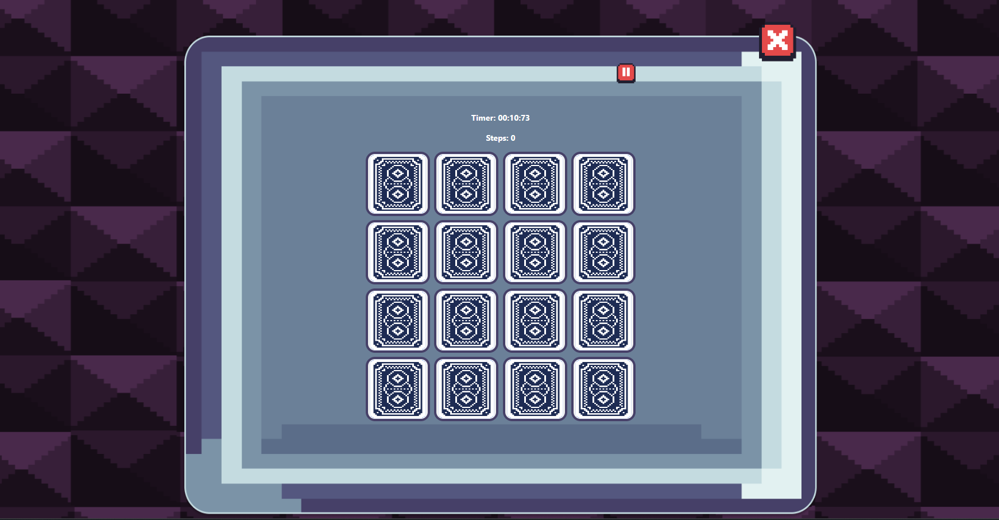

# MemoryGame


## Logged in user
displaying the Play, custom, Highscore, and Exit Button<br>
 

## Custom Feature
User can input a number of custom pairs to play with by selecting the star icon on the menu. <br><br>
 

# Build Setup

```bash
# install dependencies
$ npm install

# serve with hot reload at localhost:3000
$ npm run dev
```

## Directory
The working tree should look like this.<b4>


## Code for index.vue
Call the main component <MemoryGame />
```bash
<script>
import MemoryGame from '../components/MemoryGame.vue'

export default {
  name: 'IndexPage',
  components: {
    MemoryGame
  },
}
</script>

<template>
  <body>
      <MemoryGame/>
  </body>
</template>
```
